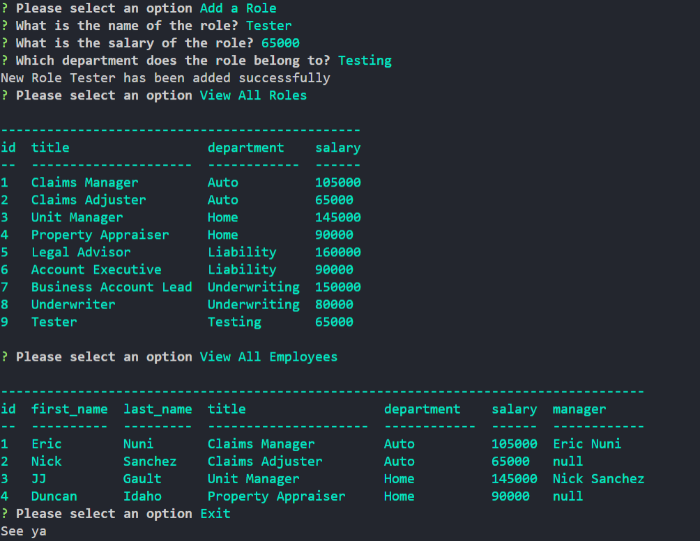

# Workforce Manager
  
  

 
  
  ## Technologies
  

  ## Description 
  This is database application for managing an organization of employees, roles, salaries and managers. It input is captured terminal prompts using node web module inquirer and database management is done through mySQL.
  

  ## Table of Contents
  * [Installation](#installation)
  * [Usage](#usage)
  * [License](#license)
  * [Contributions](#contributions)
  * [Tests](#tests)
  * [Questions](#questions)
  
  ## Installation 
  download or fork repo and install dependencies located in package.json file.

  ## Usage 
  start application by entering the command node index.js in terminal after setup is completed

  ## Contributions
  N/A

  ## Questions 
  
  Feel free to contact me at jgault87@gmail.com 
  you can also visit my [GitHub](https://github.com/jgault87) profile.
  

